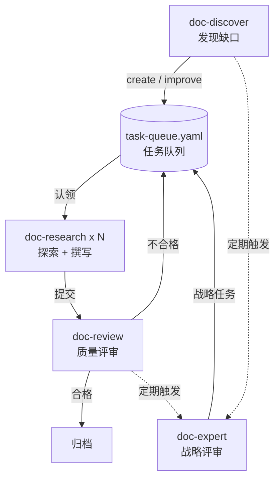

# autodoc

基于 [Claude Code](https://docs.anthropic.com/en/docs/claude-code) 的自动化文档生成框架，可应用于任何软件项目。将源码探索、文档撰写、质量评审全流程自动化，通过多 worker 并行编排实现无人值守的持续文档生成。

## 设计理念

**方法论驱动，而非随意写作**。autodoc 基于 [Diataxis](https://diataxis.fr/) 框架将文档分为教程、操作指南、参考资料和解释说明四个象限，每种类型有独立的模板、写作标准和质量检查表。文档不是「能写就写」，而是按方法论规划、按标准生产、按检查表验收。

**自动探索与发现**。框架内置 13 种检测模式（从模块扫描、源码漂移检测到端到端旅程发现、决策考古），能主动扫描源码识别文档缺口，自动生成结构化任务进入队列。不需要人工盘点「还有什么没写」。

**Generator-Evaluator 分离**。文档撰写（doc-research）和质量评审（doc-review）由完全独立的角色完成。这避免了同一 agent 自评时的系统性偏差——生成器只管写，评估器用二元评分表严格打分，不合格的打回重做。

**无人值守运行**。`autodoc.py` 是一个多 worker TUI 编排器，自动从任务队列中调度任务、分配 Claude Code worker、监控进度。配合 `/loop` 命令或直接运行编排器，可以实现持续的文档生产流水线。

**项目无关的框架设计**。所有 skill 逻辑与项目无关，项目特有的信息（源码路径、优先级规则、角色定义、探索策略）全部通过 `_methodology/` 和 `_meta/` 配置。适配新项目只需修改配置文件，不需要改动 skill 代码。

## 工作流

autodoc 的核心是一个 discover -> research -> review 循环：



1. **doc-discover** 扫描源码，发现文档缺口，生成 create/improve 任务
2. **doc-research** 从队列认领任务，探索源码，撰写文档
3. **doc-review** 对产出文档用 12 项检查表打分，不合格的生成 improve 任务回到队列
4. **doc-expert** 从读者视角审视文档库整体，发现跨文档的矛盾、断裂和盲区

`autodoc.py` 编排器自动驱动这个循环，多个 worker 并行工作。

## 前置条件

- [Claude Code](https://docs.anthropic.com/en/docs/claude-code) CLI
- Python 3.10+
- [uv](https://docs.astral.sh/uv/)

## 快速开始

```bash
# 1. 克隆到目标项目
cd /path/to/your/project
git clone git@github.com:joycastle/autodoc.git autodoc
cd autodoc

# 2. 链接源码
ln -s /path/to/your/project/src src
# 多目录项目：mkdir src && ln -s ../backend src/backend && ln -s ../frontend src/frontend

# 3. 配置路径映射
cp _meta/source-path-mapping.template.md _meta/source-path-mapping.md
# 编辑 _meta/source-path-mapping.md，填入项目实际路径

# 4. 安装依赖并运行
uv sync
uv run python autodoc.py
```

详细的定制方法见下方「定制指南」。

## Skill 套件

在 Claude Code 中可手动调用各 Skill：

| 命令 | 角色 | 用途 |
|------|------|------|
| `/doc-discover` | 探测器 | 扫描源码，发现文档缺口，生成任务 |
| `/doc-expert` | 战略评审 | 从读者视角审视文档库整体质量 |
| `/doc-research` | 生成器 | 认领任务，探索源码，撰写文档 |
| `/doc-review` | 评估器 | 对完成文档进行二元评分 |
| `/mermaid-lint` | 校验器 | 检查 Mermaid 图表是否符合规范 |

每个 skill 的 SKILL.md 是精简的入口文件（~100-150 行），详细的执行逻辑存放在 `references/` 子目录中按需加载。

## 定制指南

autodoc 的所有项目特有信息集中在四个位置，适配新项目时只需修改这些文件。

### `_methodology/` -- 方法论

方法论文件定义了「如何写文档」的标准和策略。可根据项目特点调整。

| 文件 | 作用 | 常见定制 |
|------|------|---------|
| `01-diataxis-framework.md` | Diataxis 四象限分类说明 | 通常不需要改 |
| `02-extraction-workflow.md` | 文档提取的 8 阶段工作流 | 调整阶段划分或验收标准 |
| `03-quality-standards.md` | 质量维度、代码比例、写作规范、各类型写作要点 | 调整代码比例上限、添加项目特有的写作规范 |
| `04-research-planning.md` | 研究计划模板和覆盖率追踪方法 | 填入项目实际的系统列表和优先级 |
| `05-naming-conventions.md` | 文件命名和 Diataxis 目录结构 | 调整前缀映射或目录组织方式 |
| `06-priority-and-types.md` | 任务优先级判定规则和文档类型判定规则 | 调整优先级权重（如哪些模块是 P0） |
| `07-exploration-strategies.md` | 各文档类型的源码探索策略和 prompt 模板 | 根据技术栈调整探索重点和 Grep 模式 |

新建 `06-audience-roles.md` 可定义项目的读者角色（如后端开发、前端开发、运维），skill 会据此调整文档的写作深度和术语使用。

### `_meta/` -- 元数据与协议

元数据文件定义了运行时的协议和标准。

| 文件 | 作用 | 定制方法 |
|------|------|---------|
| `source-path-mapping.template.md` | 源码路径映射模板 | 复制为 `source-path-mapping.md`，填入项目的目录结构、模块划分规则、编程语言 |
| `quality-checklist.md` | 各类型 12 项二元检查表 + Contract 评估规则 | 调整检查项的严格标准，添加项目特有的质量要求 |
| `task-schema.md` | 任务队列 YAML schema 和状态机 | 通常不需要改，除非要扩展任务字段 |

运行过程中还会自动生成以下文件（已在 `.gitignore` 中排除）：

- `task-queue.yaml` / `task-queue.md` -- 当前任务队列
- `task-archive.yaml` -- 已完成任务归档
- `research-log.md` -- 研究日志
- `documentation-gaps.md` -- 覆盖率追踪
- `contracts/` -- Sprint Contract 和评估记录

### `templates/` -- 文档模板

7 套文档模板对应 Diataxis 的各种文档类型。模板中使用 `{占位符}` 标记需要填充的位置。可根据项目需求调整章节结构或添加项目特有的必填章节。

### `CLAUDE.md` -- 项目规范

`CLAUDE.md` 定义了 Claude Code 在本项目中的行为规范，包括写作格式、命名约定、代码比例限制等。适配新项目时，可在此文件中补充：

- 项目特有的术语对照表
- 特殊的代码引用格式要求
- 需要 Claude 注意的项目约定

## 目录结构

```
autodoc/
├── autodoc.py                          # 多 worker TUI 编排器
├── CLAUDE.md                           # Claude Code 行为规范
├── README.md
├── pyproject.toml
├── _methodology/                       # 文档方法论（项目可定制）
│   ├── 01-diataxis-framework.md        #   Diataxis 分类框架
│   ├── 02-extraction-workflow.md       #   文档提取工作流
│   ├── 03-quality-standards.md         #   质量标准与写作要点
│   ├── 04-research-planning.md         #   研究计划方法
│   ├── 05-naming-conventions.md        #   命名与目录规范
│   ├── 06-priority-and-types.md        #   优先级与类型判定
│   └── 07-exploration-strategies.md    #   源码探索策略
├── templates/                          # 文档模板（项目可定制）
│   ├── architecture-template.md
│   ├── system-analysis-template.md
│   ├── tutorial-template.md
│   ├── howto-template.md
│   ├── reference-template.md
│   ├── theory-template.md
│   └── journey-template.md
├── _meta/                              # 协议与标准（项目可定制）
│   ├── quality-checklist.md            #   二元评分表 + Contract 规则
│   ├── task-schema.md                  #   任务队列 YAML Schema
│   └── source-path-mapping.template.md #   源码路径映射模板
├── .claude/skills/                     # Skill 套件（框架核心，通常不改）
│   ├── doc-discover/                   #   文档健康监测
│   │   ├── SKILL.md
│   │   └── references/
│   ├── doc-expert/                     #   文档库战略评审
│   │   ├── SKILL.md
│   │   └── references/
│   ├── doc-research/                   #   自主研究循环
│   │   ├── SKILL.md
│   │   ├── references/
│   │   └── scripts/                    #   任务认领、格式校验脚本
│   ├── doc-review/                     #   质量审计与评分
│   │   └── SKILL.md
│   └── mermaid-lint/                   #   Mermaid 图表校验
│       └── SKILL.md
├── src/                                # -> 符号链接到目标项目源码
└── docs/                               # 生成的文档输出目录
```

## 许可证

MIT
