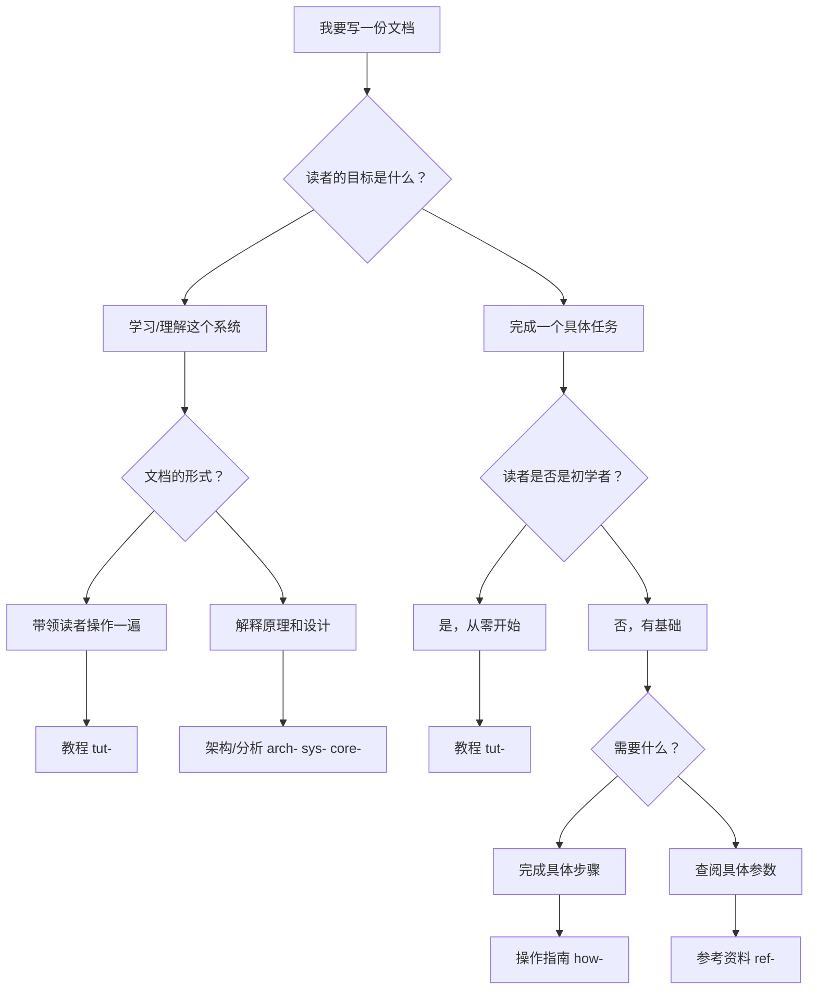

# Diátaxis 框架指南

Diátaxis 是一套文档组织方法论，将文档按照「用途」和「知识类型」划分为四个象限。本项目采用 Diátaxis 作为顶层目录结构，结合前缀编号作为文件命名约定。

## 四象限定义

```
                学习中（Learning）          工作中（Working）
             ┌──────────────────────┬──────────────────────┐
  实践性      │   01_tutorials/       │   02_howto/           │
  （Practical）│   教程                │   操作指南            │
             ├──────────────────────┼──────────────────────┤
  理论性      │   04_explanation/     │   03_reference/       │
  （Theoretical）│  架构与分析           │   参考资料            │
             └──────────────────────┴──────────────────────┘
```

### 教程（Tutorials）— `01_tutorials/`

**核心问题**：「这个系统怎么学习？」

教程是学习导向的文档，带领读者完成一个具体的学习旅程。读者跟着教程一步一步操作，最终达到可验证的学习成果。

特征：
- 以读者的学习旅程为主线，而不是以系统功能为主线
- 每一步都有明确的操作和预期结果
- 不解释「为什么」，而是「做什么」
- 结束时读者应能独立完成类似任务

适合放在这里的内容：新人入门指引、核心概念演练、系统搭建步骤。

### 操作指南（How-to Guides）— `02_howto/`

**核心问题**：「我怎么完成 X 任务？」

操作指南是任务导向的文档，面向已有基础知识的读者，帮助完成具体的实际任务。

特征：
- 以任务为单位，直接切入目标
- 假设读者已理解基本概念
- 允许有多条可选路径
- 不需要解释每个步骤背后的原理

适合放在这里的内容：「如何添加新的关卡类型」、「如何配置活动系统」、「如何排查网络协议问题」。

### 参考资料（Reference）— `03_reference/`

**核心问题**：「X 是什么？它有哪些参数？」

参考资料是信息导向的文档，提供准确、完整的技术规格。读者在工作时查阅，不是从头到尾阅读。

特征：
- 结构高度一致（表格、列表为主）
- 追求完整性和准确性，不追求可读性
- 描述系统的现状，不解释历史
- 与源码保持严格对应

适合放在这里的内容：数据表字段说明、配置项枚举值、协议字段定义、API 接口规格。

### 架构与分析（Explanation）— `04_explanation/`

**核心问题**：「为什么这样设计？系统是如何运转的？」

架构与分析是理解导向的文档，帮助读者建立对系统的深层认知。不直接服务于当前任务，而是建立长期的理解框架。

特征：
- 提供背景、历史、设计意图
- 讨论权衡取舍和替代方案
- 包含批判性分析（问题、风险、技术债）
- 使用 Mermaid 图表辅助说明架构

适合放在这里的内容：架构分析（`arch-`）、系统分析（`sys-`）、核心机制分析（`core-`）、理论建构（`theory-`）。

## 文档类型选型决策树



## 常见误判与纠正

| 误判 | 正确归类 | 原因 |
|------|---------|------|
| 把「系统架构说明」放在参考资料 | Explanation | 架构是理解，不是查阅 |
| 把「配置项说明」放在操作指南 | Reference | 配置项是规格，不是步骤 |
| 把「排查问题步骤」放在教程 | How-to | 解决问题是任务，不是学习 |
| 把「新人入门」写成参考资料 | Tutorial | 入门需要引导，不是查阅 |

## 混合文档的处理

现实中有些文档难以归入单一类型。处理原则：

1. 按文档的**主要目的**归类，而不是次要内容
2. 允许交叉引用，但不允许内容重复
3. 当一个文档同时满足两种类型时，考虑拆分为两份文档
