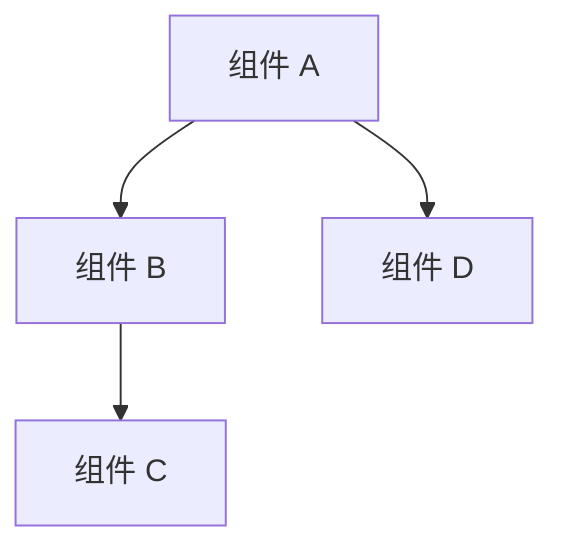
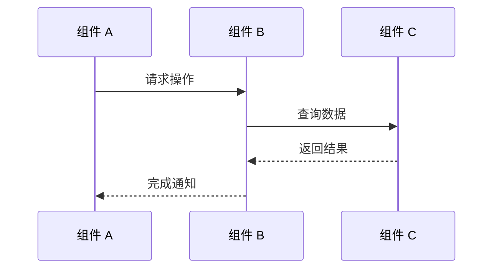

# [系统名称] 架构分析

> **覆盖范围**：[本文档覆盖的主要内容]
> **置信度**：HIGH / MEDIUM（[说明依据，如「基于源码直读」或「含推断成分」]）
> **源码路径**：`{SOURCE_ROOT}/path/to/system/`

## 系统定位

[一段话描述该系统在整个项目中的位置和职责。回答：这个系统做什么、为什么需要它、它与哪些系统交互。]

## 整体架构

[Mermaid 图表：展示系统的主要组成部分和它们之间的关系。控制在 8 个节点以内。]

上图展示 [图表的核心含义，用文字再次说明关键关系]。

## 核心组件

[列出系统的主要类/模块，每个条目包含：职责描述 + 源码引用。]

### [组件名称]

**职责**：[一句话描述]

**关键字段：**

| 字段 | 类型 | 说明 |
|------|------|------|
| `fieldName` | `type` | [说明] |

**关键方法：**

- `MethodName()`（`{SOURCE_ROOT}/path/to/File.cs:45`）：[方法的作用]
- `OtherMethod()`（`{SOURCE_ROOT}/path/to/File.cs:78`）：[方法的作用]

### [另一个组件]

[同上格式。]

## 核心流程

[描述系统最重要的一到两个流程，使用 Mermaid 序列图。]

[图表说明：解释上图中关键步骤的含义，特别是不显而易见的部分。]

## 设计决策

[解释关键的设计选择，说明「为什么这样做」而不是「做了什么」。每个决策说明背景和权衡。]

**[决策 1 名称]**：[说明决策内容和选择理由。如有替代方案被放弃，说明原因。]

**[决策 2 名称]**：[同上。]

## 外部依赖

[列出该系统依赖的外部系统、第三方库或服务，以及依赖关系的性质（强依赖/弱依赖）。]

| 依赖对象 | 依赖类型 | 依赖原因 |
|---------|---------|---------|
| [系统/库名] | 强依赖 | [原因] |
| [系统/库名] | 弱依赖 | [原因] |

## 已知问题与风险

[必须包含的章节。描述具体问题，不得含糊。]

**[问题 1]**：[具体描述，包含源码位置引用和影响范围。]（`{SOURCE_ROOT}/path/to/File.cs:156`）

**[问题 2]**：[同上。]

## 待验证项

[列出本文档中置信度为 LOW 的结论，供后续验证。]

- `[置信度: LOW]` [结论描述] — 推断依据：[说明]
- `[置信度: LOW]` [结论描述] — 推断依据：[说明]

## 相关文档

<!-- 格式：- [中文文档标题](相对路径) -- 与本文的关联说明 -->
- [系统全景概览](arch-01-system-overview.md) -- 上层架构背景（示例，按实际替换）
