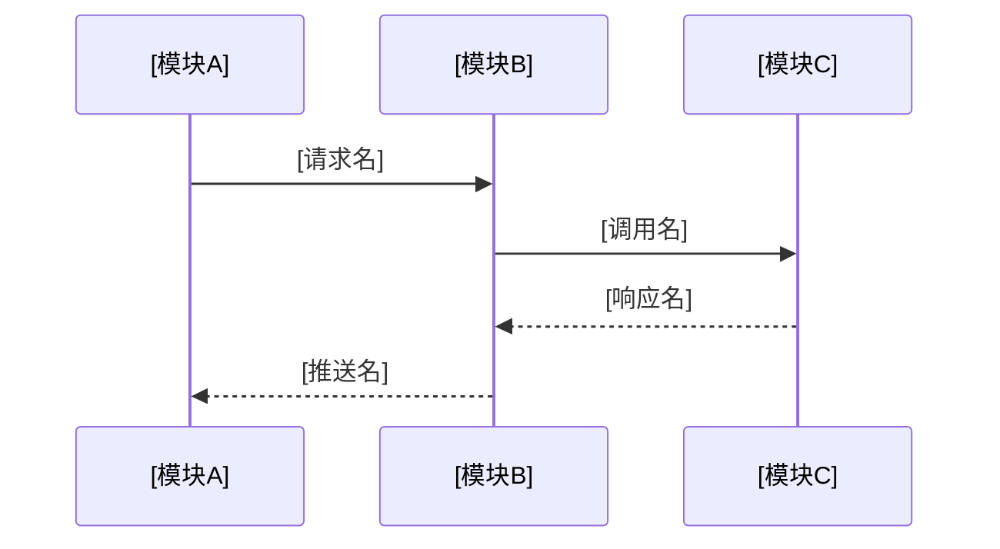

# [端到端旅程标题]

> **分析范围**：[调用链的起点和终点，横跨的模块]
>
> **置信度**：[HIGH / MEDIUM / LOW]
>
> **源码路径**：[涉及的主要源码目录]

## 概述

[两到三句话描述这条调用链的业务含义、为什么重要、涉及多少个模块。]

## 完整调用链

[图后说明段落：解释序列图中的关键数据流方向、模块边界处的格式转换。]

## 阶段一：[阶段名称]

[以时间顺序描述该阶段的处理逻辑。每个关键步骤引用具体源码路径和行号。]

数据格式转换：`[Proto消息名]`(Proto) → `[struct名]`(biz) → `[表名/PK/SK]`(DynamoDB)

详细的 [子系统] 机制参见 [对应 sys- 文档标题](相对路径) 的「具体章节名」章节。

## 阶段二：[阶段名称]

[同上格式。按时间顺序，不是按模块。读者跟着数据流走。]

## 阶段 N：[阶段名称]

[继续按时间顺序。]

## 故障分支

### [故障场景 1]

[描述该故障的触发条件、系统行为和恢复路径。引用具体的错误处理代码。]

### [故障场景 2]

[同上。]

## 时序约束

### 必须串行的步骤

| 前置步骤 | 后续步骤 | 原因 |
|---------|---------|------|
| [步骤A] | [步骤B] | [为什么不能并行] |

### 可并行的步骤

| 并行组 | 步骤 | 并发机制 |
|--------|------|---------|
| [组名] | [步骤列表] | [goroutine pool / conc.WaitGroup 等] |

## 相关文档

<!-- 格式：- [中文文档标题](相对路径) -- 与本文的关联说明 -->
- [沿途模块的 sys- 文档](相对路径) -- 该模块的详细分析
